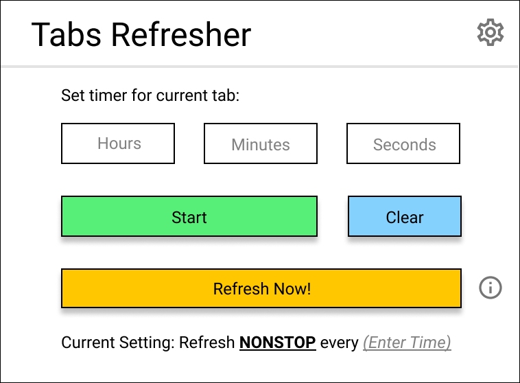

### Tabs Refresher
Tabs Refresher is a Google is a Chrome extension that allows users to set a time interval to automate page refresh at each tab level.

By: **Cherie Young**

**Task list:**

* [x] Enable extension on all tabs.
* [x] Add main UI for extension popup.
* [x] Implement default behavior for Refresh Now button.
* [ ] Add input to accept setting timer.
* [ ] Add validation for user input.
* [ ] Save state (user settings) for user's current session.
* [ ] Implement countdown and display countdown. When countdown reaches 0, refresh the tab, then restart countdown.
* [ ] Clear timer.
* [ ] Implement start/stop for the countdown timer.
* [ ] Implement Advance settings menu and functionality*
* [ ] Add logic to handle user setting for Refresh Now button to either not affect existing countdown or to restart countdown timer.

## Possible Future Features

* [ ] A page to show and edit all opened tabs in window and their timers/countdown settings.

## Preview

